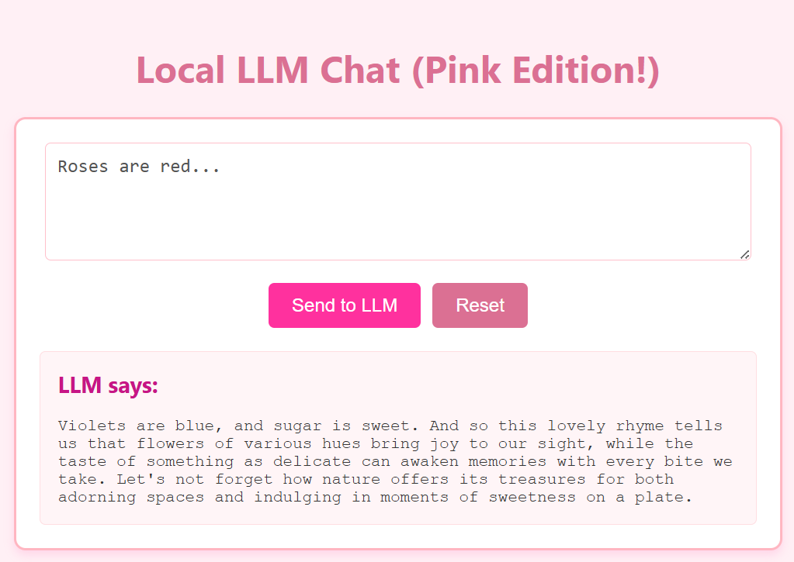

# Pink LLamas



# Local LLM Development Environment

This project sets up a local development environment for working with LLMs using Ollama and a Vue.js frontend.

## Prerequisites

1. Docker and Docker Compose installed
2. NVIDIA Container Toolkit installed for GPU support
3. Git (optional, but recommended)

## Getting Started

1. **Create a new Vue.js app** (first time only):
   ```bash
   mkdir -p frontend
   docker run --rm -v ${PWD}/frontend:/app node:lts npx @vue/cli create .
   # When prompted, choose Vue 3 with TypeScript and any other options you prefer
   ```

2. **Start the services**:
   ```bash
   docker-compose up --build
   ```

3. **Access the applications**:
   - Ollama API: http://localhost:11434
   - Vue.js dev server: http://localhost:8080

## Using Ollama

To download and run a model (e.g., llama2):

```bash
docker exec -it ollama ollama pull llama2
docker exec -it ollama ollama run llama2
```

## Development

- The `frontend` directory is mounted into the container, so you can edit files directly on your host machine.
- The development server will automatically reload when you make changes.
- API requests from the frontend should be made to `http://ollama:11434` from within the container.

## Stopping the Services

Press `Ctrl+C` in the terminal where you ran `docker-compose up`, or run:

```bash
docker-compose down
```